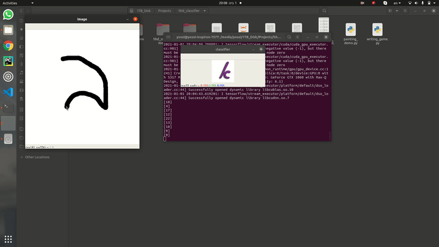

# Handwriting Hebrew Classifier

## The Project
This repository deals with a classification problem of hebrew handwriting letters.

I will use a modified vertion of the Handwriting Hebrew Dataset or HHD for short.

- For the modified version of the dataset [HHD modified](https://mega.nz/file/qJMT3aYC#l5QYuTpCLNHPxVA7gajt7XRsrUqAzKRQgP6rQx3u6y8)
- For the original version of the dataset [HHD](https://www.cs.bgu.ac.il/~berat/data/hhd_dataset.zip)

## Demo

In the demo you will need to write a letter from the hebrew handwriting alphabeth and the program will identify it.

| Key  | Action |
| ------------- | ------------- |
| b | Clear the canvas inorder to draw something new  |
| d | detect the letter in the canvas  |
| r | erase mode | 




## Installation
Install using Anaconda:

```
conda env create -f environment.yml
conda activate hhd
python3 painting_demo.py # or writing_game.py
```

Install using pip
```
pip3 install -r rquirements.txt
python3 painting_demo.py # or writing_game.py
```
